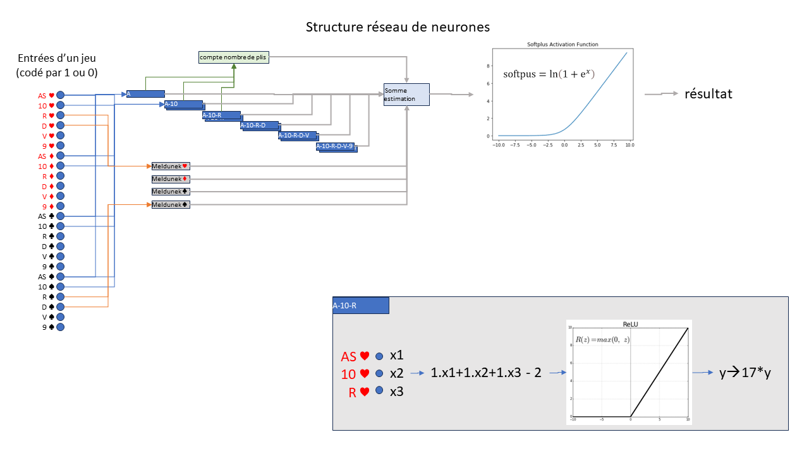
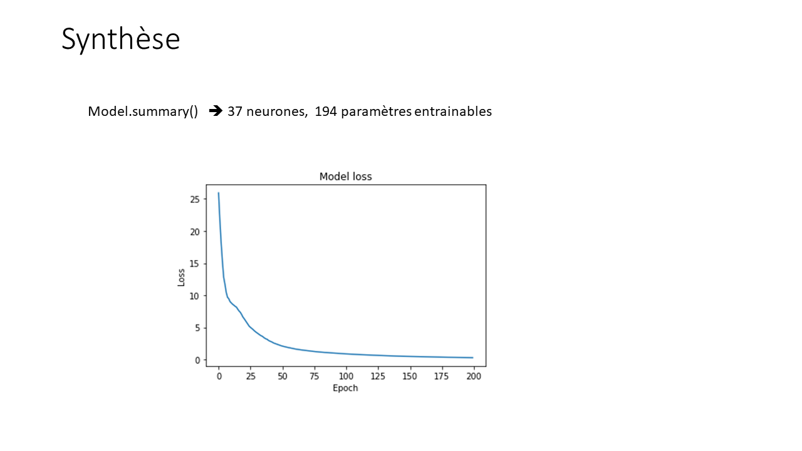
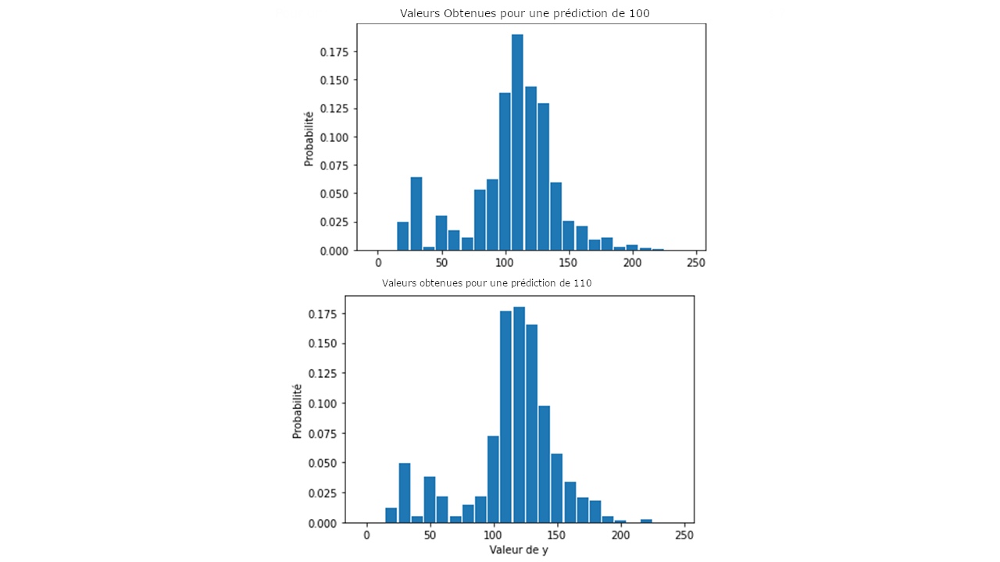

# Thousand-Schnapsen-Bet-Prediction
### Description
Ce projet permet d'estimer la valeur que l'on peut obtenir avec une main donnée au Mille (aussi appelé shnapsen russe). On en déduit des probabilités sur la valeur réelle grâce à l'estimation.

### Dépendances
- tensorflow
- keras
- numpy
- matplotlib
- sys

### Fonctionnement

